# Project Title

# *Kidney Tumor Detection and Cure*

### Problem Statement:
Kidney tumors, both benign and malignant, represent a significant health challenge, with Renal Cell Carcinoma (RCC) being the most common type of kidney cancer. Early detection and accurate classification of kidney tumors are crucial for effective treatment and better patient outcomes. However, the manual analysis of kidney tumor images from medical scans is time-consuming and prone to human error. Additionally, the absence of proper tumor classification and treatment recommendations may delay critical care.

This project aims to develop a deep learning-based solution for the detection and classification of kidney tumors using EfficientNet. The model is trained to recognize multiple types of tumors, including benign and malignant cases, and classify them into distinct categories. It also provides treatment or follow-up recommendations based on the classification, aiding healthcare providers in making informed decisions. By integrating automated image processing and classification, this project seeks to improve the accuracy and speed of kidney tumor diagnosis, leading to more effective treatment strategies and enhanced patient care.


# Types and Stages of Kidney Tumors
## Types of Kidney Tumors:
### 1.Renal Cell Carcinoma (RCC):

A common form of kidney cancer, often detected at various stages of progression.

I_Malignant_RCC: Early-stage RCC, usually localized within the kidney.

II_Malignant_RCC: Intermediate-stage RCC, potentially showing signs of local spread.

III_Malignant_RCC: Advanced-stage RCC, with regional or distant metastasis.

### 2.Secondary Kidney Tumors:

Tumors that have metastasized to the kidney from other primary sites.

I_Malignant_Secondary: Early-stage secondary kidney tumor, usually less aggressive.

II_Malignant_Secondary: Intermediate-stage tumor, with signs of further spread.

III_Malignant_Secondary: Advanced-stage secondary tumor, often with widespread metastasis.

### 3.Benign Kidney Tumors:

Non-cancerous tumors that may not pose an immediate threat but require monitoring.

I_Benign_Adenoma: Small, slow-growing benign tumor; usually does not require aggressive treatment.

I_Benign_Angiomyolipoma: A benign tumor composed of blood vessels, muscle, and fat.

I_Benign_Lipomas: Benign fatty tumors; generally asymptomatic but may need monitoring for size changes.

### 4.No Tumor:

No_Tumor: Indicates the absence of any tumor, representing a healthy or non-diseased kidney.


### Features:

1. **Accurate Kidney Tumor Detection**:
   - Utilizes a deep learning model based on **EfficientNet** to accurately detect and classify kidney tumors.
   - Supports multiple types of tumors, including both **benign** and **malignant** forms.

2. **Tumor Classification**:
   - Classifies tumors into distinct categories based on severity, including:
     - **Renal Cell Carcinoma (RCC)** stages I, II, and III.
     - **Secondary tumors** that have spread from other parts of the body.
     - **Benign tumors** such as adenomas, angiomyolipomas, and lipomas.
     - **No Tumor** (Healthy kidneys).

3. **Personalized Cure and Treatment Information**:
   - Provides stage-specific **cure information** and recommended treatment steps for each type of tumor.
   - Guides on lifestyle modifications, screening, and medical consultations based on the classification.
   - Offers actionable insights such as **screening schedules**, **lifestyle adjustments**, and **treatment adherence** tips.

4. **Image Processing and Base64 Encoding**:
   - Automatically processes medical images (e.g., MRI, CT scans) using advanced image preprocessing techniques.
   - Converts processed images to **base64-encoded format** for efficient rendering in web applications.

5. **User-Friendly Web Interface**:
   - Developed using **Flask**, offering an intuitive interface for uploading kidney scan images and viewing results.
   - Displays the predicted tumor type, **confidence score**, and **encoded image** of the scan.
   
6. **EfficientNet-based Pretrained Model**:
   - Leverages the state-of-the-art **EfficientNet-B0** model, fine-tuned for kidney tumor classification tasks.
   - Uses **transfer learning** for enhanced performance, allowing for more accurate detection even with limited data.

7. **Scalable and Extensible**:
   - Can be extended to include additional tumor types, stages, or even other organs for comprehensive health diagnostics.
   - Easily integrable with other medical systems and datasets.


## 🔗 Links
[](https://aicraftalchemy.github.io/)
[](https://www.linkedin.com/in/lokesh-e-60a583201)


## 🛠 Skills
Machine Learning, Deep Learning ,Pytorch


## Installation
  
 ```bash
   python 3.11.9
```


    

# Learnings and Challenges
   
#### Learnings:
1. **Deep Learning Model Optimization**:
   - Gained hands-on experience using **EfficientNet**, a powerful and efficient deep learning architecture, and observed how transfer learning can significantly enhance performance with limited data.
   - Explored different image preprocessing techniques, such as **normalization** and **resizing**, to ensure better model generalization and accuracy.

2. **Medical Image Classification**:
   - Learned about the unique challenges involved in working with **medical datasets**, where high accuracy is essential, and the implications of false negatives or false positives are critical.
   - Enhanced understanding of different **kidney tumor types and stages**, along with the importance of accurately distinguishing between benign and malignant tumors.

3. **Integration of Cure Information**:
   - Successfully integrated a feature that not only detects the tumor type but also provides **personalized treatment recommendations**. This helped bridge the gap between diagnosis and actionable insights.

4. **Flask Web Development**:
   - Improved skills in developing a **user-friendly web application** using Flask, allowing seamless interaction between the user and the model.
   - Implemented features like image upload, real-time predictions, and base64-encoded image rendering to optimize the user experience.

5. **Handling Model Predictions and Confidence**:
   - Learned how to handle model predictions and convert them into user-friendly outputs, including tumor classification and confidence scores, ensuring transparency in the prediction results.

#### Challenges:

1. **Imbalanced Dataset**:
   - One of the key challenges was handling an **imbalanced dataset** for the different tumor types. Some types of kidney tumors were underrepresented, which led to difficulties in achieving consistent classification accuracy across all categories.
   - Implemented strategies like data augmentation and experimented with **class-weighting** to mitigate the effects of class imbalance.

2. **Model Selection and Training Time**:
   - Selecting the optimal **EfficientNet variant** (b0 to b7) was a challenging decision, balancing accuracy and computation resources. Initially, larger models like **EfficientNet-B5** showed promising results but required significant computational power and longer training times, leading to the eventual selection of **EfficientNet-B0** for a faster and more efficient workflow.
   
3. **Preprocessing and Normalization**:
   - Properly handling and preprocessing medical images was a complex task. The images varied in size and quality, requiring consistent **normalization** and **image transformations** to ensure compatibility with the model.
   - Iterated over various resizing and scaling techniques to maintain the integrity of the images while keeping them compatible with the model’s input requirements.

4. **Confidence Interpretation**:
   - Interpreting **confidence scores** from the model and ensuring that users could understand the reliability of the prediction presented a challenge. This required balancing transparency without overwhelming the user with technical details.

5. **Deployment and Scalability**:
   - Deploying the model in a scalable manner while ensuring efficient handling of multiple requests and large images was a challenge, particularly in a **Flask** environment. Managing memory and performance was crucial to delivering a smooth user experience.

### Optimizations

1. **EfficientNet-B0**: Used for its balance of accuracy and computational efficiency through transfer learning.
2. **Optimized Image Preprocessing**: Applied resizing and normalization with `torchvision.transforms` to streamline input data.
3. **Batch Prediction**: Processes images in batches, improving scalability.
4. **Softmax for Confidence**: Provides clear, interpretable probability scores for predictions.
5. **Inference Optimization**: `model.eval()` and `torch.no_grad()` ensure faster and memory-efficient inference.
6. **Flask Scalability**: Efficient handling of file uploads and image processing with minimal memory overhead.

## Run Locally

Clone the project

```bash
  git clone https://link-to-project
```

Go to the project directory

```bash
  cd my-project
```

Install dependencies

```bash
  pip install -r requirements.txt
```

Start the server in terminal

```bash
  python app.py
```

### Screenshots

Below are screenshots demonstrating the project:

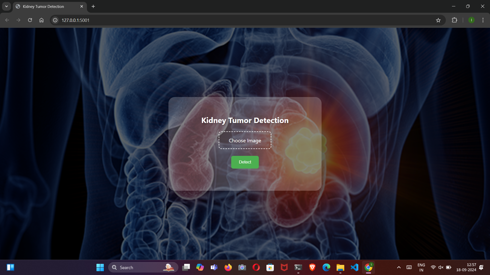
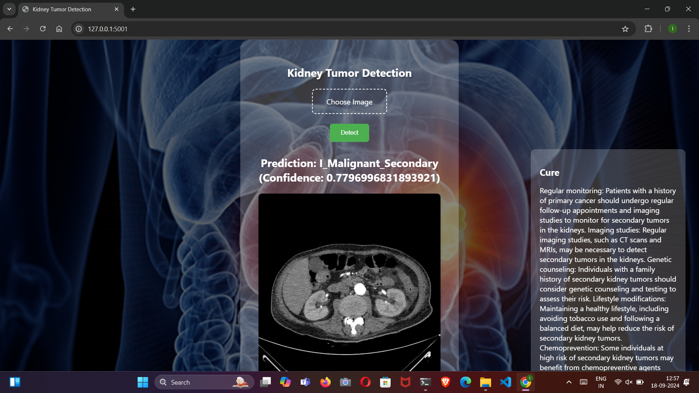
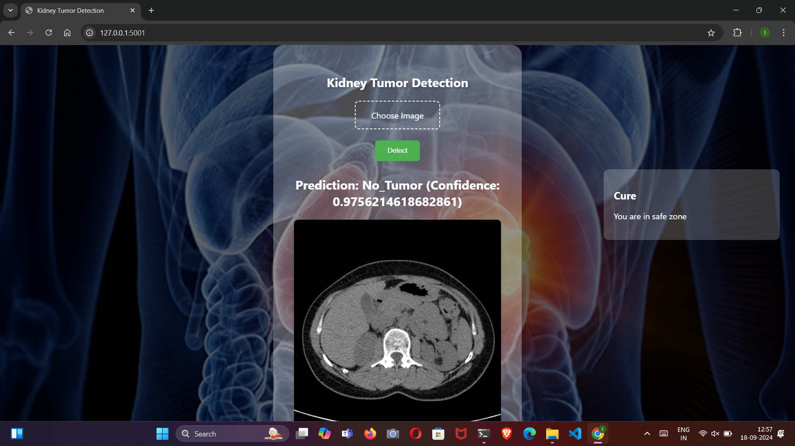
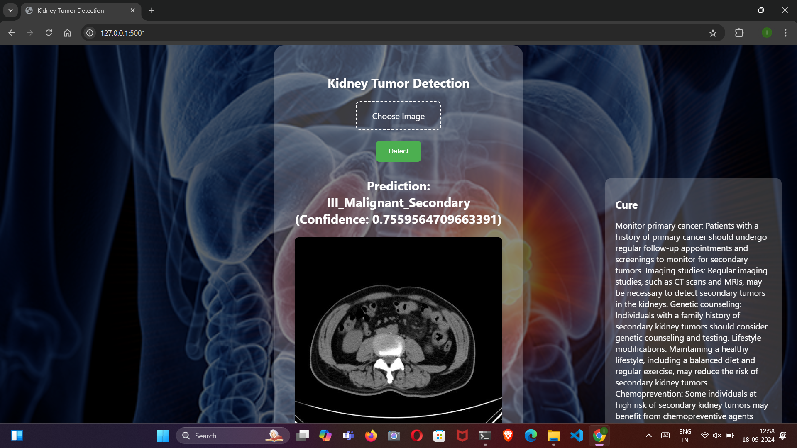
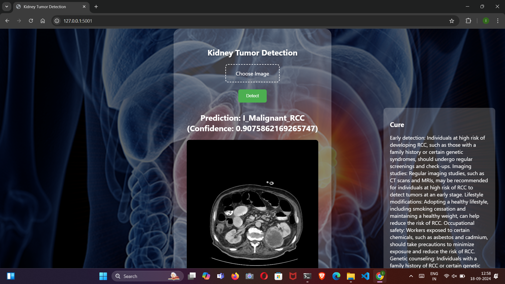
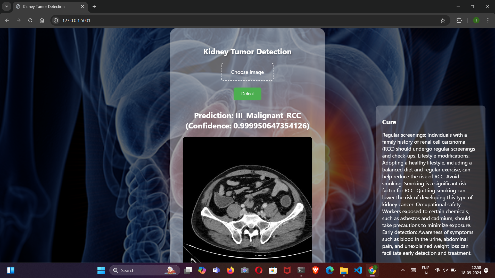
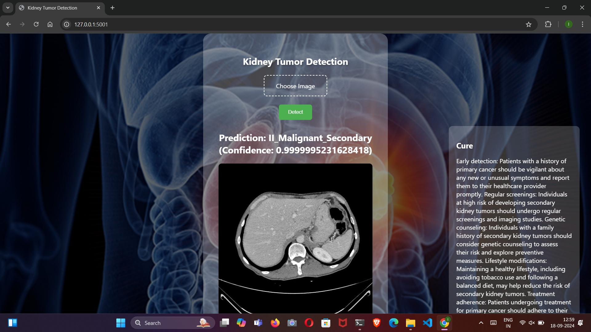
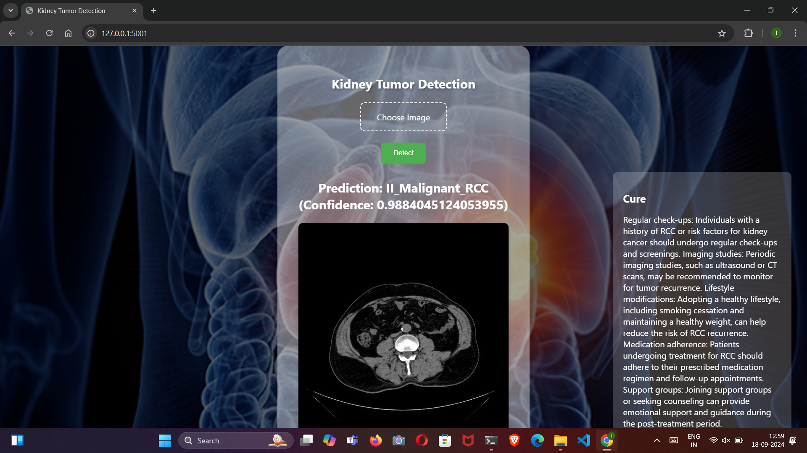
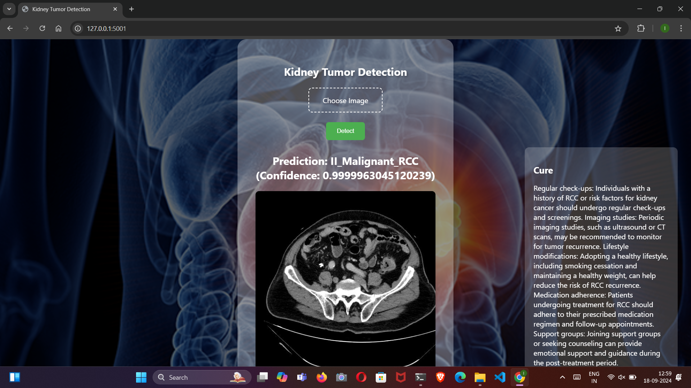
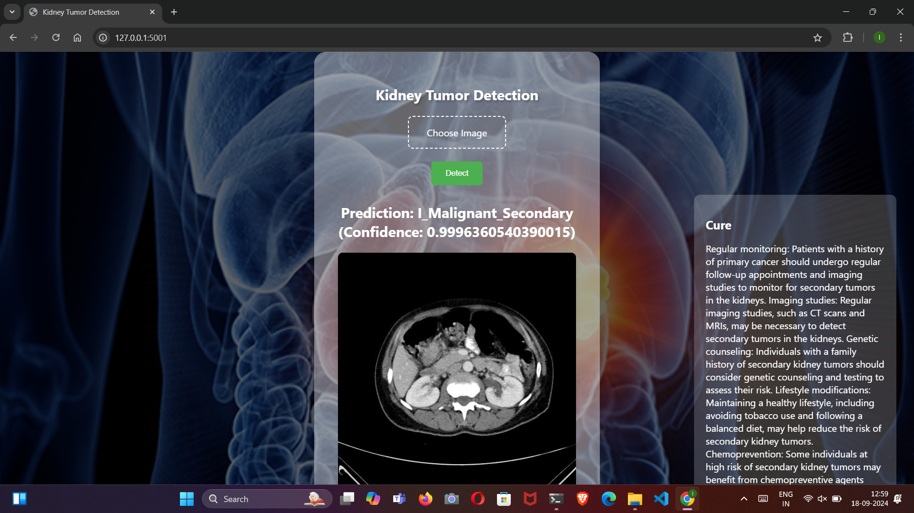
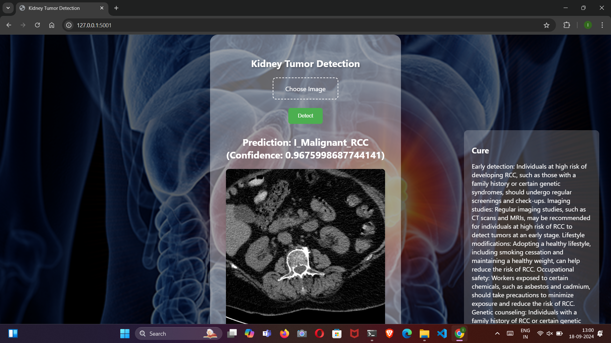
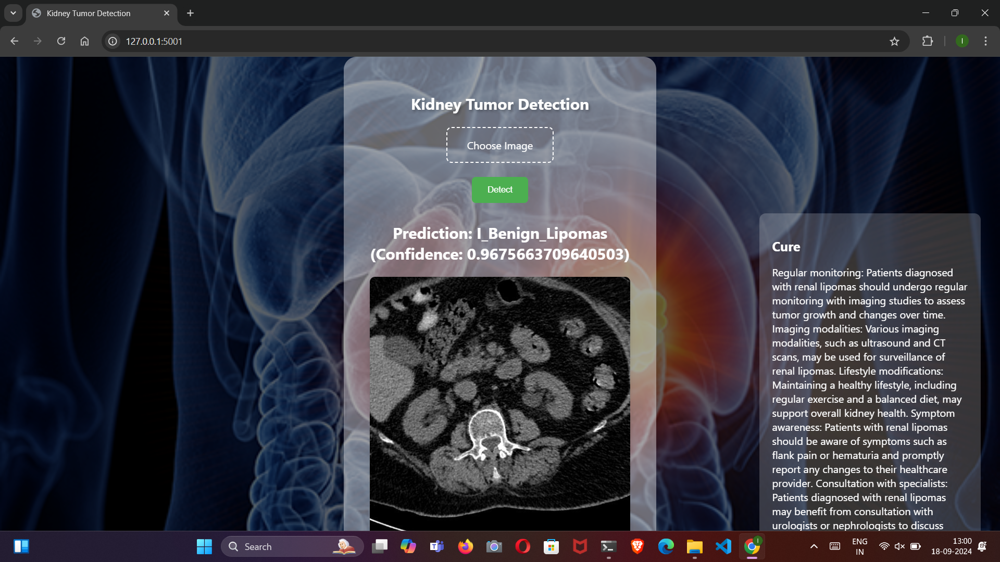
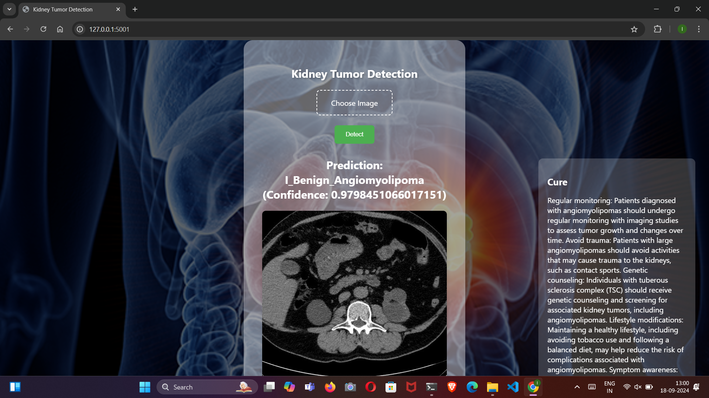
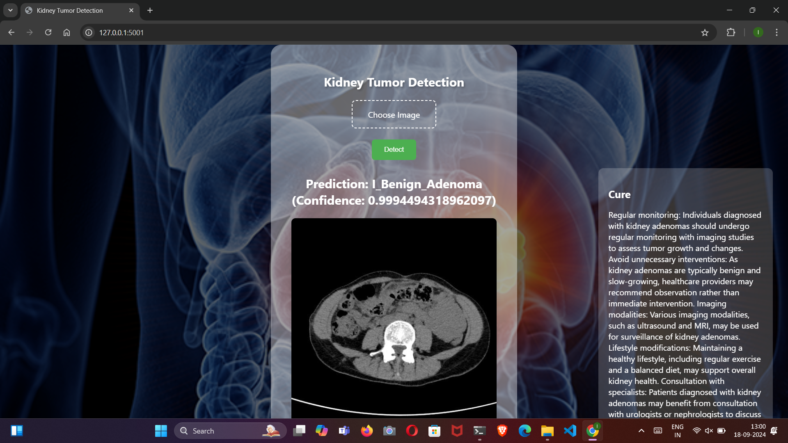

These images showcase the functionality and user interface of the application.
## Support

For support, email aicraftalchemy@gmail.com 


## Feedback

If you have any feedback, please reach out to us at aicraftalchemy@gmail.com

Phone: +91 7661081043

